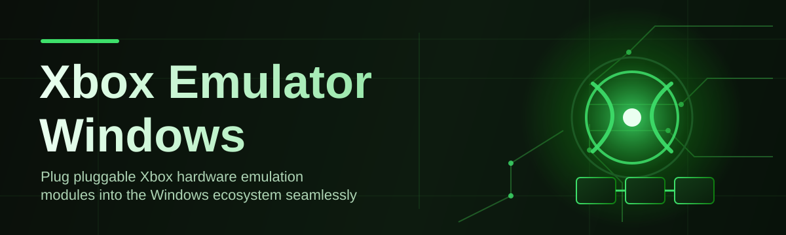
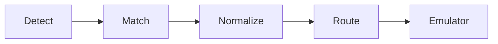

# xbox-emulator-controller 🎮⚡

  

*A native Windows control layer that bridges Xbox-style input and emulator output into one clean, no-friction workflow.*

  

## 🕹️ Overview

**xbox-emulator-controller** is a lightweight Windows companion app built for people who live inside emulator setups and got tired of juggling five different tools just to get a controller talking to a game. It sits between your input devices and your emulator stack, normalizing signals, mapping profiles, and keeping everything in sync so you can focus on playing instead of debugging driver stacks at 1am.

This project exists because the "Xbox Emulator Windows" space has always been fragmented — every emulator has its own input quirks, every controller driver behaves slightly differently, and profile management is usually an afterthought bolted onto some other tool. We wanted a single, purpose-built controller hub that treats input mapping, profile switching, and emulator handshaking as first-class citizens instead of side features.

Whether you're a retro tinkerer running a shelf of console emulators, a streamer who needs rock-solid controller behavior on camera, or a developer prototyping input schemes, this tool is built to be the calm, dependable layer underneath your setup. No accounts, no background services phoning home — just a focused Windows app doing one job really well.

  

---

## 🚀 What Makes It Tick

> [!NOTE]
> Every capability below was designed around one idea: emulator input should feel invisible when it works, and obvious to fix when it doesn't.

- **Adaptive Mapping Engine** — automatically detects connected controllers and suggests a mapping profile based on the emulator you're pointing it at, instead of forcing you to build one from scratch every time.

- **Profile Vault** — save, name, and instantly swap between unlimited controller profiles, so switching from a fighting-game layout to a platformer layout takes one click, not five minutes of remapping.

- **Latency-Aware Polling** — a tuned polling loop that keeps input lag imperceptible, which matters a lot more than people expect once you're deep into precision platformers or rhythm titles.

- **Dead Zone Sculpting** — fine-grained stick and trigger curve editing with live visual feedback, so drift and over-sensitivity stop being a guessing game.

- **Multi-Controller Routing** — plug in more than one pad and assign each to a different virtual slot, ideal for local co-op sessions across emulated titles.

- **Silent Background Mode** — minimizes to tray and stays out of your way, only surfacing when a mapping conflict or disconnection actually needs your attention.

- **Diagnostic Console** — a built-in log viewer that shows exactly what the controller is sending and what the emulator is receiving, so troubleshooting stops being guesswork.

- **Portable Configuration** — export your entire profile set as a single file you can carry between machines without reinstalling anything.

> [!TIP]
> Rename your profiles after the emulator core you use them with (e.g. "SNES – Arcade Stick"). Future-you will thank present-you.

---

## 🧭 Getting Off the Ground

1. **Visit the landing page** — head to the download button above or below to reach the official project page.

2. **Download the Windows package** — grab the latest build; there's nothing else to fetch, no bundled installers to click through blindly.

3. **Run the executable** — launch it directly, no elevated permissions dance required for standard use.

4. **Plug in and map** — connect your controller, let the Adaptive Mapping Engine take a first pass, then fine-tune from there.

> [!IMPORTANT]
> Always download from the official landing page linked in this README. Third-party mirrors may bundle unrelated software you didn't ask for.

---

## 🧩 System Requirements

| Component | Minimum |
|---|---|
| OS | Windows 10 (64-bit) or Windows 11 |
| Storage | Under 200 MB free space |
| Input | Any XInput or DirectInput compatible controller |
| Dependencies | None — fully standalone, no runtime installs needed |
| Internet | Only required for the initial download |

<strong>Why no dependencies?</strong>

 

The app ships as a self-contained Windows binary. There's no separate runtime to install, no background service that needs registering, and no configuration files scattered across your system drive before you can even open it. Everything the app needs travels with it.

---

## ⚙️ How It Works

The internal flow is intentionally simple — fewer moving parts means fewer things to break mid-session.

1. **Detection** — the app scans connected devices and identifies controller type and capabilities.

2. **Profile Match** — it checks your saved profiles for a match, or offers to build a fresh one.

3. **Signal Normalization** — raw input is smoothed, deadzone-adjusted, and translated into a consistent format.

4. **Emulator Handoff** — the normalized signal is routed to your active emulator process in real time.

5. **Live Monitoring** — the diagnostic console keeps watching for drops, conflicts, or reconnects.

> [!WARNING]
> If you have multiple controller utilities running simultaneously (vendor software, other remapping tools), input routing conflicts can occur. Close overlapping tools before mapping a profile.

---

## 🛟 Troubleshooting

**Q: My controller shows as detected but the emulator isn't receiving input.**
A: Check that no other input-remapping tool is holding an exclusive lock on the device — only one app can own that channel at a time.

**Q: Stick drift appears even though the controller is brand new.**
A: Open the Dead Zone Sculpting panel and nudge the inner threshold up slightly; some pads ship with tighter factory tolerances than others.

**Q: The app minimizes to tray but I can't find it again.**
A: Look for the icon in the hidden tray icons overflow menu — Windows sometimes buries background apps there by default.

**Q: Profiles disappeared after a Windows update.**
A: Re-import your exported profile file from Portable Configuration; keeping a backup copy is strongly recommended.

**Q: Two controllers are getting mapped to the same virtual slot.**
A: Manually reassign slots in Multi-Controller Routing — auto-assignment occasionally collides when devices connect in rapid succession.

**Q: Is administrator access required to run this?**
A: No, standard user permissions are sufficient for all normal operation.

---

## 🎨 UI / UX Details

  

The interface leans minimal on purpose — a controller mapper should feel like a dashboard, not a puzzle.

- **Keyboard Shortcuts**

  - `Ctrl + S` — save current profile

  - `Ctrl + N` — create new profile

  - `Ctrl + Tab` — cycle through connected controllers

  - `F5` — refresh device list

  - `Ctrl + L` — open diagnostic console

- **Themes** — Light, Dark, and an OLED-friendly true black mode, switchable instantly from the settings panel.

- **Settings Persistence** — every setting is saved locally and reloaded automatically on next launch, no reconfiguration ritual required.

> [!TIP]
> Dark mode plus the Diagnostic Console makes long troubleshooting sessions considerably easier on the eyes.

---

## 🤝 Contributing & Community

We built this in the open because emulator input handling is a problem best solved with many hands and many controller quirks tested against it.

- Found a mapping edge case with an unusual controller? Open an issue with your device details.

- Have an idea for a new profile feature? Discussions are open and genuinely read.

- Want to improve documentation, translations, or diagnostics output? Pull requests are very welcome.

> [!NOTE]
> Please describe your Windows version and controller model when filing an issue — it drastically speeds up reproduction and fixes.

---

## 📜 License

Released under the [MIT License](LICENSE) © 2026. Use it, modify it, build on top of it — just keep the license notice intact.

---

## ⚠️ Disclaimer

This project is an independent, community-built controller and input-mapping utility. It is not affiliated with, endorsed by, or sponsored by Microsoft or Xbox in any official capacity. "Xbox" is referenced solely to describe compatibility context. Use of emulator software is subject to the laws and terms applicable in your region — this tool does not distribute, host, or provide any copyrighted game content.

  

